# June 15, 2025: Coming back for R2 - freer pinout & QWIIC

Note: I built R1 over the span of a few months, modifying a few things as I went. I didn't record many details, but the finished results are pictured in the README.md.

I wanted to come back to this project as I realized a few days earlier while revisiting the HT16K33A datasheet that I didn't realize before (since I wasn't too proficient in reading datasheets; in fact I doubt I even read it in detail back then). In my original design, I decided to follow the exact connections Adafruit used in their module, not realizing that any ROW pin on the HT16K33A can be connected to any row on the display matrix and such with COL pins too. This meant that I could simplify the routing a lot. I also wanted to include QWIIC connectors to make it easy to chain 2 modules together (the max that can be connected on the same bus, since I2C addr select is 3 bits/jumpers).

I tested the setup on a breadboard and asked Claude to make a modification to the library implementation for the new pinout, which worked fine. I also wanted to change the adapter board to include an actual microcontroller itself rather than a soldered module. The current solution is not too neat/ideal. I'm thinking maybe a NRF52840/NRF52833 module.

I started (and finished) work on the matrix module itself pretty easily. It took a bit to remember how to use the replicate layout plugin again and route the rest manually.

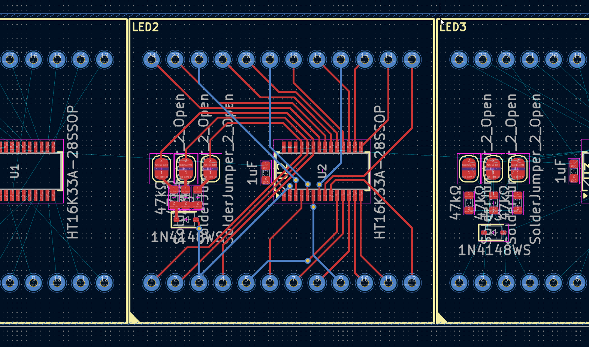

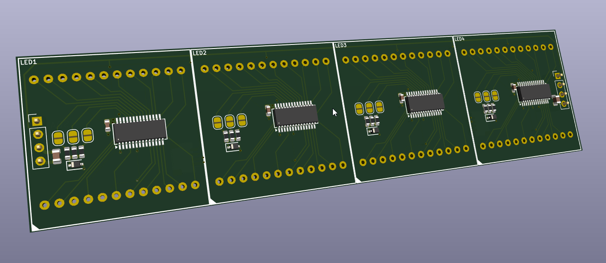

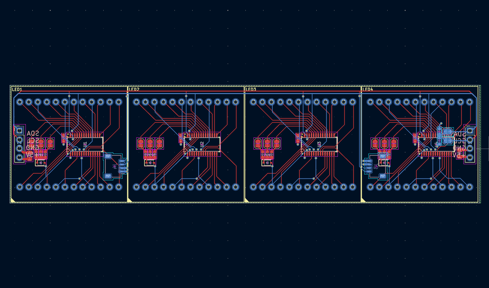

**Total time spent: 3 hours**

# July 9, 2026: Started adapter board - switched to ESP32-C3

I have been a bit busy and procrastinating taking on the main task of making the adapter board. But I have finally started working on it. I decided to go with the ESP32-C3 WROOM module since it's small, has enough GPIO and is fairly cheap. The main reason I switched from what was initially planned (despite actually importing the symbol and starting the schematic) was that I wanted to make the programming/setup easy through something like a web dashboard which I would make a PWA. Would be much simpler than using Zephyr or Arduino IDE with Nordic MCU. ESP ecosystem w/ Arduino also has more overall support. It is also slightly cheaper than the NRF52840/NRF52833 module from Ebyte I planned on using.

I spent a while reading over the ESP32-C3 WROOM datasheet, integration guide, placement requirements and took a lot at the schematic + PCB for the devboard. I also read up on the boot and reset behaviour, and figured it would just be easier to use a CH340 instead of onboard USB for programming, since it supports autoreset.

Since board space isn't an issue, I went for CH340N. It took me a while to find an appropriate LDO for the system, since my system probably would have current peaks of 500mA+. I wanted to use a SOT-23 package since it's easy to route and after scrolling past the pages of 1117-style regulators, I found the AP2114HA, which is suitable. After drafting a quick schematic, I called it for the day. But before that, I cleaned up the schematic a bit.

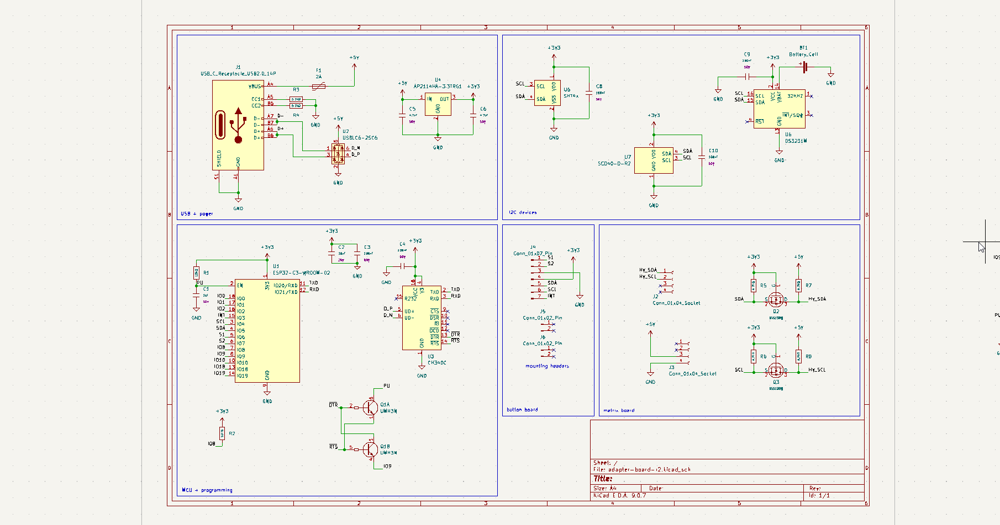

**Total time spent: 3.5 hours**

# July 10, 2026: Routed the adapter board - then sticker shock at JLC

I finally locked in an routed the majority of the adapter board, although I still had quite a bit of empty space on the board; it felt like a lot of space being wasted. The routing was fairly simple and took me in total about 2.5 hours becuase of the low component density. The main things were connecting the D+/D- pairs together on the horizontal USB connector since they crossed each other in a somewhat X shape and I needed 5V to pass through the middle of the connector. Eventually, I just resorted to using the inner GND layer to connect them as there wasn't a filled region in that area due to keepout.

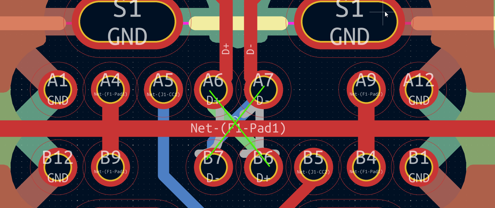

After I while I was done routing:

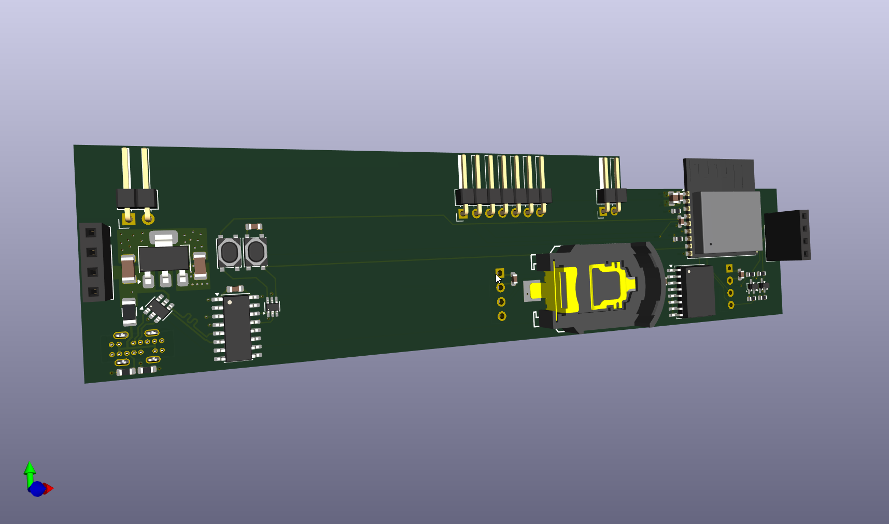
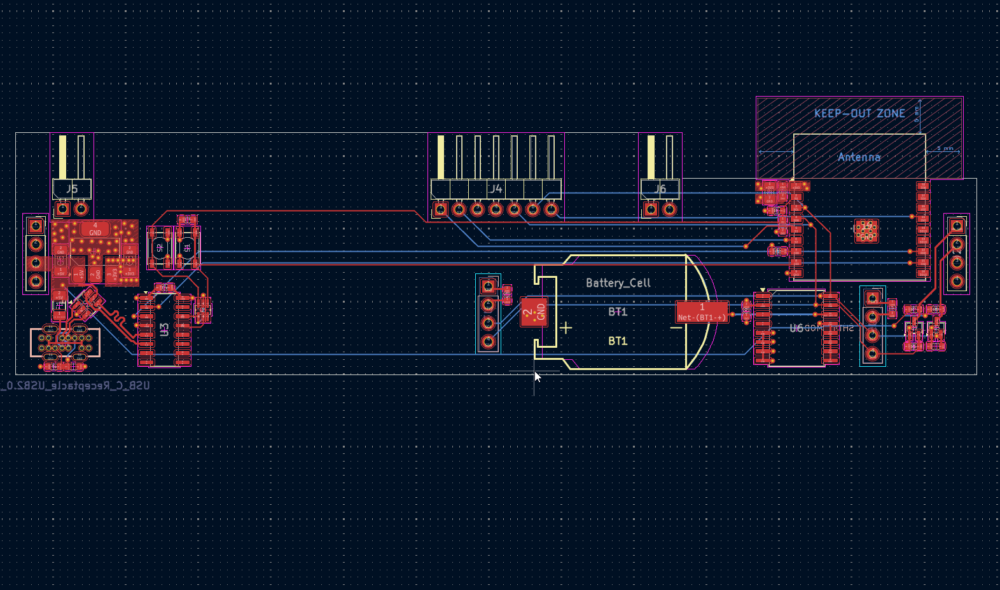

However, when I was done routing, I put the PCB into JLC to see how much it would cost, since I've never ordered a 4 layer board above 100x100mm. It turned out to be quite expensive...

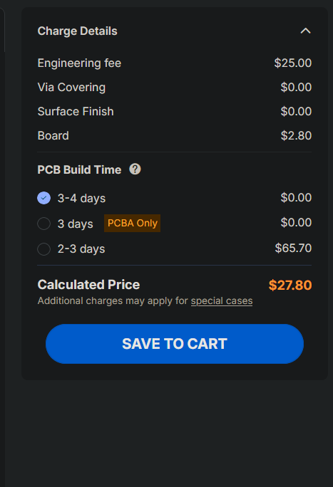

I figured this would be acceptable for the matrix board since essentially all of the space was utilized, however since the adapter board is pretty bare, I figured it would likely be better to split this into 2 boards potentially, or make the board smaller and attach it to the matrix board with an additional pin header in the middle between one of the modules.

First I tried to see what it would look like to split the board into 2, with a pin header in the middle between the two modules. Even with this setup, the board would be pretty empty and there would be quite a bit of space wasted.

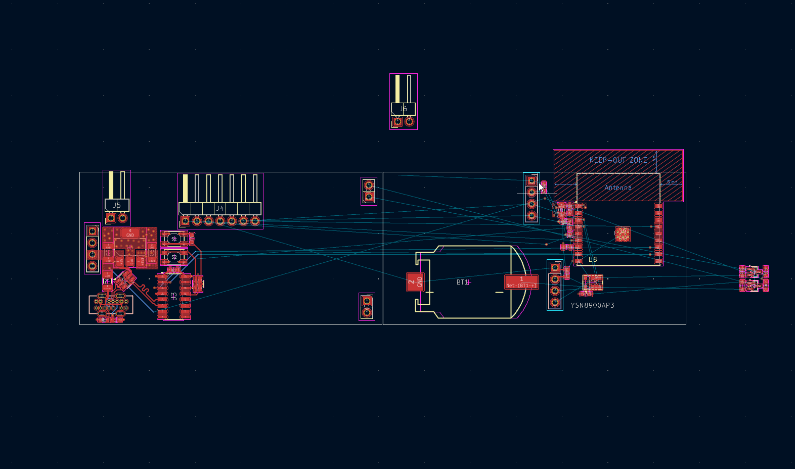

The distance betweenm the first and 3rd module is essentially 100mm, so this is essentially the maximum distance that could be supported by a single board.

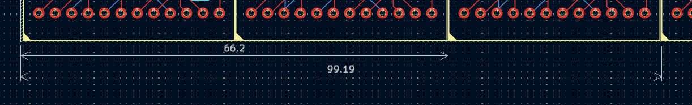

I thought initially this would be a good idea, since it would mean more space for routing and maximizing the PCB per cost that I pay for, but when I tried the rough layout, it was pretty hard to fit something in exactly 100mm without having the pin header holes on the matrix board being in a weird position or without having the pin header keepout be off the edge of the adapter board:

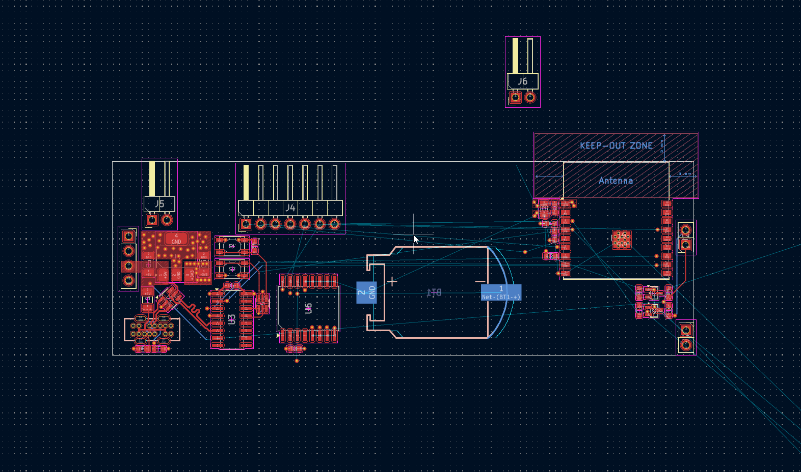
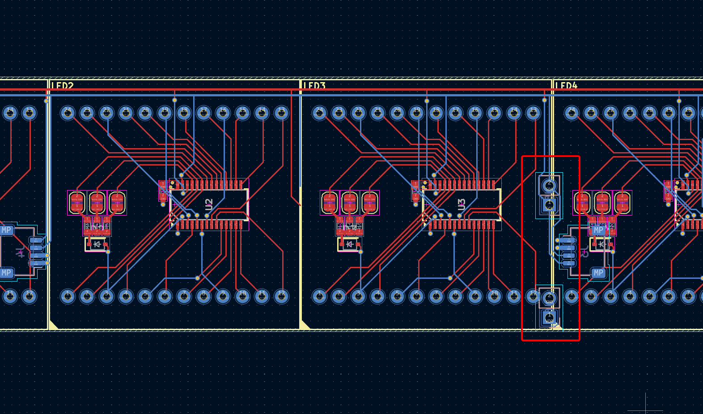

Therefore, I settled on having the adapter board be half the length of the matrix module, and then having a pin header in the middle between the two modules.

**Total time spent: 6 hours**

# July 12, 2026: Rethinking layout - sensors go on the board

Before pretty much starting again on the adapter board, I decided to rethink a bit of the layout.
After reading the ESP32-C3 WROOM datasheet/recommand layout position documentation again, I decided on this new setup:

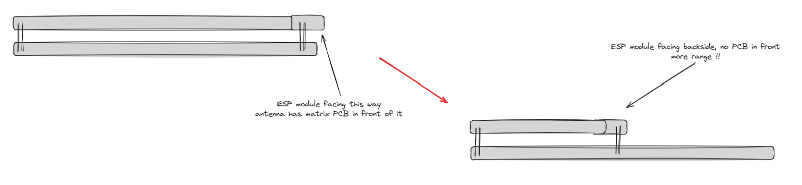
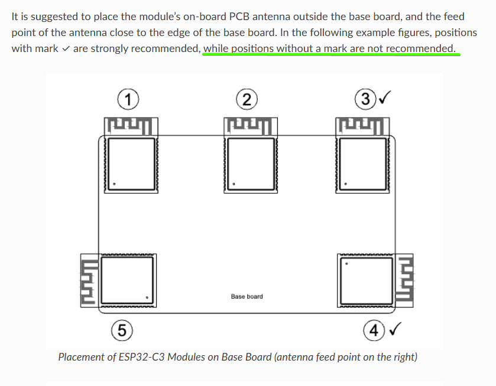

Since my previous layout had the module on the top side, I thought it might be better to place it sideways on the bottom now to accomadate more space for the pins to connect to the matrix board. Previously, I was also planning on using SCD41 and SHT41 breakout boards since they would be easy to solder, but I eventually decided to just use the actual sensors themselves and work on getting a better SMT setup, since I plan to assemble the board myself. Since everything was also going on the backside, I could include all the sensors on the same side since the SCD40 is about the same height as the vertical USB connector, which are both the tallest items on the board. I could also make an enclosure that follows one of the recommended layouts for general environment sensors to have them inside an isolated cavity in the case which is openly exposed, such that heat from components inside would not affect the sensors. Something like this:

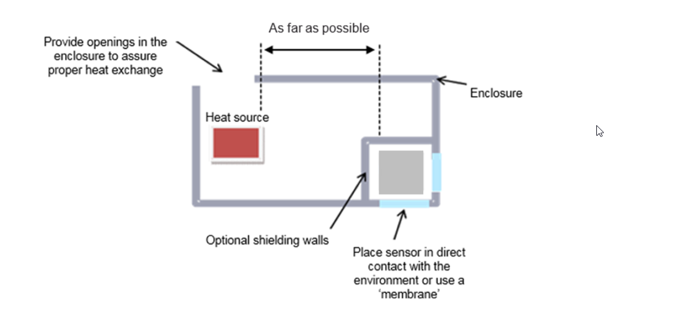

However, for now the design is intended to be caseless; which is one of the reasons why I spent so long trying to find a layout that works since pin headers need to be mounted on both sides of the board for it to be stable. I did previously work on a revision 2 of the button board which includes an 128x32 OLED, light sensor and 2 touch pads, it'll likely be redesigned later on so that I can figure out a better way to mount it to everything else with or without a case. I like the raw matrix/electronic look of the board, which is a reason why I want to keep this compatible without a case. This is still something I'm debating since environment sensors aren't too good with dust and such, but I think I'll probably make a version with a case later on.

After reading the SCD4x datasheet, I realized that the sensor has temperature and pressure compensation for CO2 concentration, so a better temperature/humidity sensor and a pressure sensor would be ideal for better accuracy. Out of the options on LCSC, I picked the ENS210 since it has the best specs based on what was available for a reasonable unit price. The SCD41 isn't available on LCSC, but I figured its big enough to order a module and desolder it, which would not be a good idea for the SHT41 since it's quite tiny. For pressure, I went with the BMP580; new and accurate. Although board heating shouldn't have much of an effect on the BMP580, I tried to keep it separate but not on an island by itself like I planned to do with the ENS210.

**Total time spent: 2 hours**

# July 16, 2026: Finished adapter board - sensors, RTC, accelerometer

After returning from a brief break, I decided to start working on the adapter board again. I decided to go with the same layout as I planned before (half the length of the matrix module), but with the new sensors and some other changes. One thing I did though was switch to the CH340X since it's smaller and I needed the extra space. Oh yeah, I also decided to go with a different RTC other than the DS3231 since it's fairly hard to source them nowadays and they're in a fairly big package. I went with a clone of the Epson RX8900SA from YXC (YSN8900AP3), which is a drop-in replacement from a trusted brand. It has an integrated TCXO in a SMD3225-10P package, making it easy to hand solder (with a reflow plate), small, accurate, and much cheaper than the DS3231.

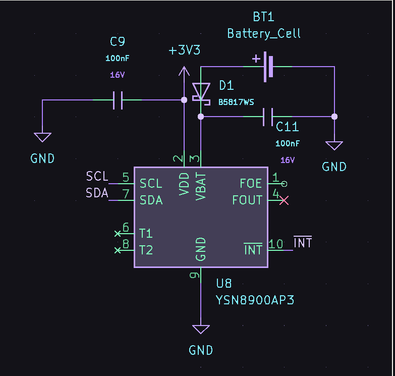

Routing in progress:

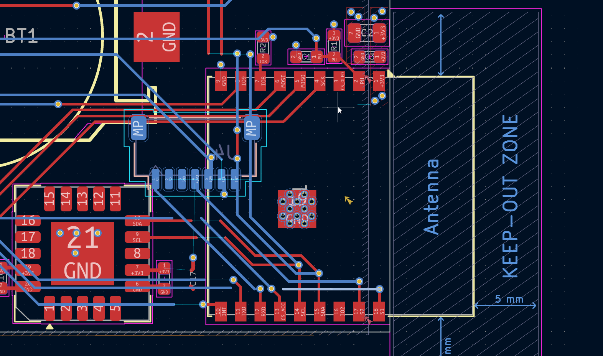

Although it took quite a bit to route and get everything ironed out, finally managed to get something I considered acceptable. It was a bit hard to route the battery holder since I had to account for the battery radius (which was not included in the footprint), but overall it was not too bad.

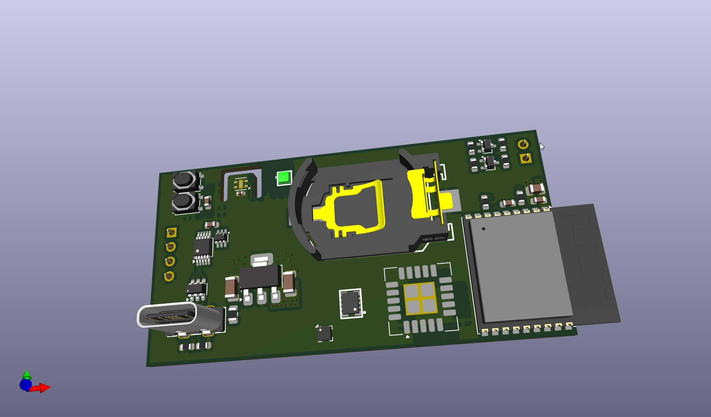
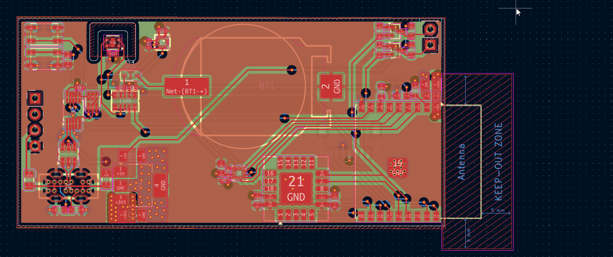

Somewhere along the way, I also decided to add an accelerometer (LIS2DW12) to make this cable of some particle motion simulation or something like an hourglass feature, which would be pretty cool especially with 3 crisp colours on the matrix displays. After exporting the BOM and PCB to LCSC and JLC, everything came out to roughly $12 for the adapter board PCB, $35 for parts, and $30 for the matrix board PCB.

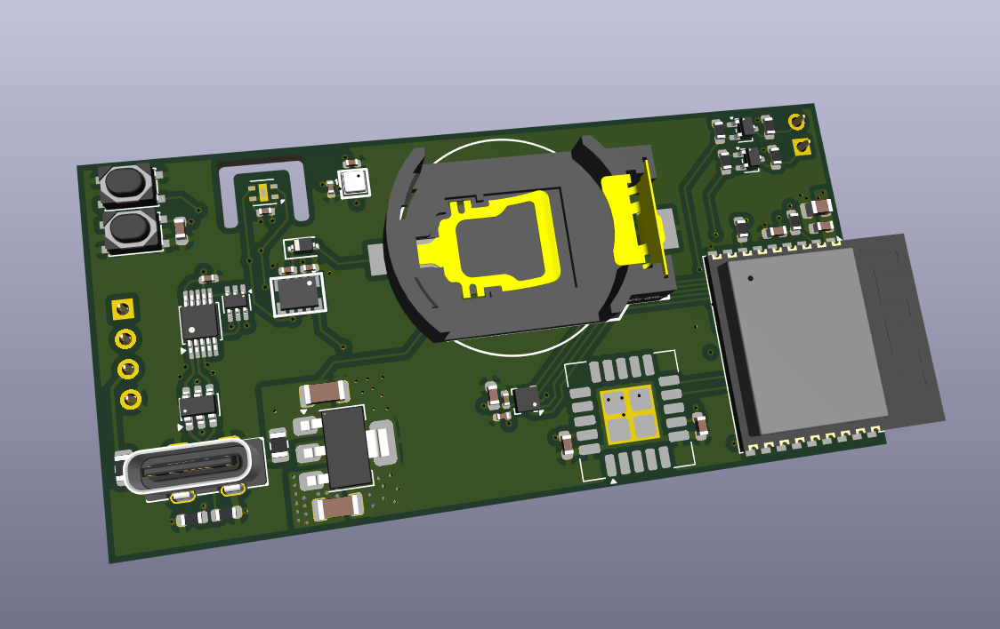

**Total time spent: 4 hours**
