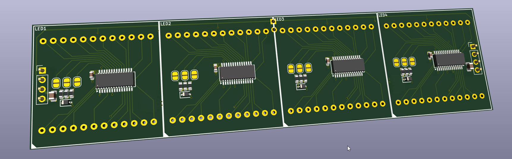
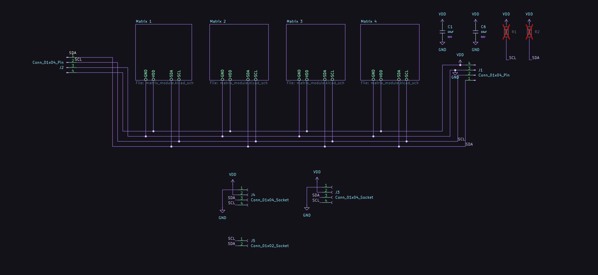
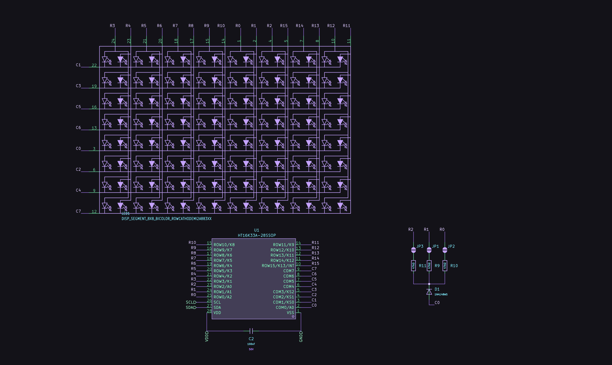
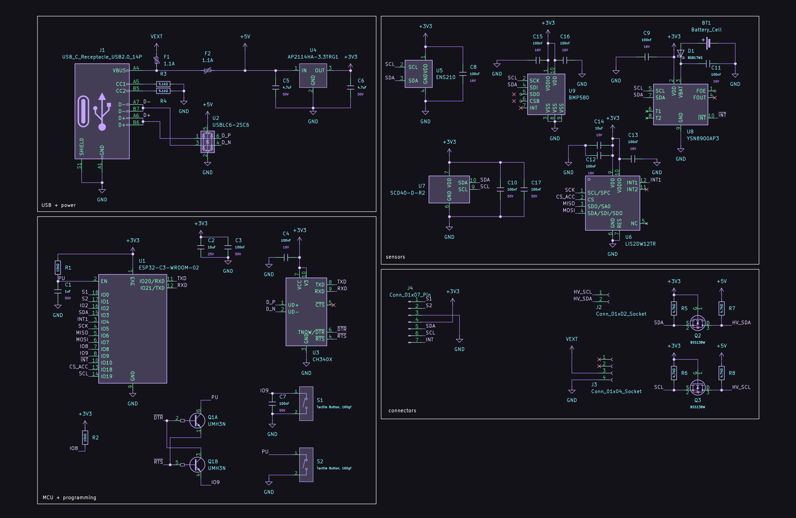
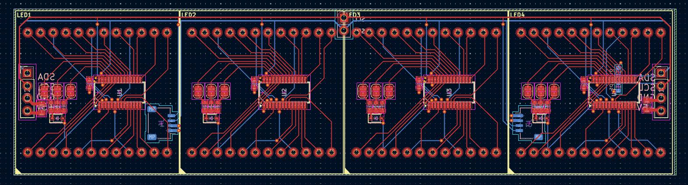
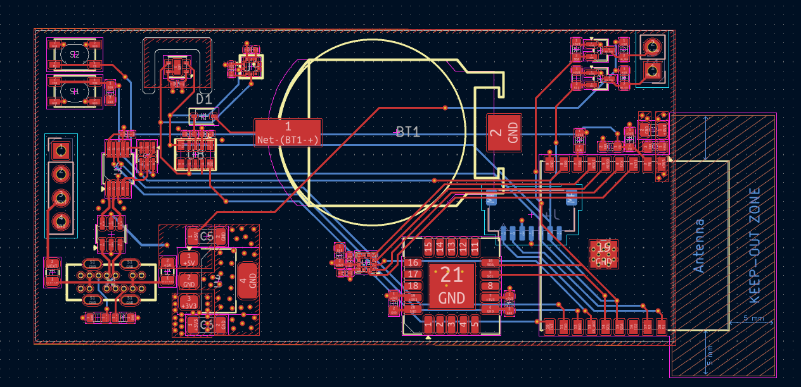

# Bicolour Matrix

A 32x8 bicolor LED matrix module composed of 4 8x8 matrices based on the Holtek HT16K33A I2C LED driver. V1 paired it with a stacked adapter (RP2040 Zero + DS3231 module); V2 redesigns the matrix routing and puts an ESP32-C3, RTC, and environment sensors on a half-length adapter board behind the display.

*V1 running as a clock*

## Inspiration

Inspired by the common 32x8 red LED matrix modules that use the MAX7219 IC, I wanted to make my own module but with more colours and functionality, while keeping the same asthetic.

I found [these](https://www.aliexpress.com/item/1005007029570407.html) modules while browsing Aliexpress and thought they could look be a cool alternative. With the red and light green variant, you can have red, a light green, and orange all in one module. As far as I'm aware, there aren't RGB modules in a similar form factor, although you can take generic WS2818 8x8 matricies and 3D print a diffuser for them, although the footprint is much bigger. This project was also partially inspired by [bitluni's LED magnet tiles](https://www.youtube.com/watch?v=L2J_eNgjxio) which I found really cool.

Unlike the single colour matricies with 16 pins, these had 24. I found [this](https://www.adafruit.com/product/902) Adafruit module and followed a similar schematic with the Holtek HT16K33A I2C LED driver.

For V2 I revisited the HT16K33A datasheet and realized any ROW/COL pin can map to any matrix row/column, thus routing got a lot simpler than matching Adafruit's pinout exactly.

## Structure

| Board | Role |
| --- | --- |
| **bicolour-matrix** | 32×8 display: 4× HT16K33A + 4× 8×8 bicolour matrices |
| **adapter-board-r2** | ESP32-C3-WROOM-02, CH340X USB-UART, YSN8900 RTC + CR2032, SCD41, ENS210, BMP580, LIS2DW12 |
| **button-board-r2** *(optional / WIP)* | OLED + light sensor + touch pads |

The adapter is half the length of the matrix board and mates with a pin header between the middle modules so that the stack stays stable without a case.

The button board is a separate interface that is connected to the adapter board with a 7-pin JST SH connector. This is meant to be customized and built by the user themselves, although I've included a sample design with an OLED, light sensor, and 2x touch pads you can start from. What you include and how you integrate it is up to you and how you want to design an enclosure.

## Pictures

### Assembled (V1)

### V2 

#### 3D

*Adapter board R2 (3D)*

*Matrix board R2 (3D)*

#### Schematics

*Matrix board schematic*

*Adapter board R2 schematic*

#### PCB

*Matrix board PCB (four HT16K33A modules)*

*Adapter board R2 PCB*

## Bill of materials

Prices are estimated from LCSC single-board quantities and AliExpress for the LED matrices.

### Matrix board (`bicolour-matrix`)

| Designator | Value | Footprint | Qty | LCSC | Unit cost (est.) | Line total (est.) |
| --- | --- | --- | --- | --- | --- | --- |
| C1, C6 | 10 µF | 0805 | 2 | C440198 | $0.02 | $0.04 |
| C2, C3, C4, C5 | 100 nF | 0603 | 4 | C14663 | $0.01 | $0.04 |
| D1, D2, D3, D4 | 1N4148WS | SOD-323 | 4 | C2128 | $0.01 | $0.04 |
| J1, J2 | 1×04 pin header | Through hole | 2 | — | $0.05 | $0.10 |
| J3, J4 | JST SH 1×04 (Qwiic-style) | SMD | 2 | — | $0.15 | $0.30 |
| J5 | 1×02 socket | Through hole | 1 | — | $0.05 | $0.05 |
| LED1, LED2, LED3, LED4 | 8×8 bicolour matrix | Module | 4 | AliExpress | $2.00 | $8.00 |
| R3, R4, R5, R9, R10, R11, R13, R14, R15, R18, R19, R20 | 47 kΩ | 0603 | 12 | C25819 | $0.002 | $0.02 |
| U1, U2, U3, U4 | HT16K33A | SSOP-28 | 4 | C5444738 | $0.54 | $2.16 |
| | | | | **Total (matrix, components only)** | | **~$10.75** |

### Adapter board (`adapter-board-r2`)

| Designator | Value | Footprint | Qty | LCSC | Unit cost (est.) | Line total (est.) |
| --- | --- | --- | --- | --- | --- | --- |
| BT1 | CR2032 holder | SMD | 1 | C7498149 | $0.15 | $0.15 |
| C1 | 1 µF | 0603 | 1 | C15849 | $0.01 | $0.01 |
| C3, C7, C10, C17 | 100 nF | 0603 | 4 | C14663 | $0.01 | $0.04 |
| C4, C8, C9, C11, C12, C13, C15, C16 | 100 nF | 0402 | 8 | C1525 | $0.005 | $0.04 |
| C14 | 10 µF | 0603 | 1 | C19702 | $0.02 | $0.02 |
| C2 | 10 µF | 0805 | 1 | C15850 | $0.03 | $0.03 |
| C5, C6 | 4.7 µF | 1206 | 2 | C29823 | $0.03 | $0.06 |
| D1 | B5817WS | SOD-323 | 1 | C7420329 | $0.05 | $0.05 |
| F1, F2 | 1.1 A fuse | 0805 | 2 | — | $0.05 | $0.10 |
| J1 | USB-C receptacle 14P | Through hole | 1 | C3151746 | $0.30 | $0.30 |
| J2 | 1×02 socket | Through hole | 1 | — | $0.05 | $0.05 |
| J3 | 1×04 socket | Through hole | 1 | — | $0.08 | $0.08 |
| J4 | JST SH 1×07 | SMD | 1 | — | $0.25 | $0.25 |
| Q1 | UMH3N | SOT-363 | 1 | — | $0.08 | $0.08 |
| Q2, Q3 | BSS138W | SOT-323 | 2 | C28646265 | $0.03 | $0.06 |
| R1, R2 | 10 kΩ | 0603 | 2 | C25804 | $0.002 | $0.004 |
| R3, R4 | 5.1 kΩ | 0603 | 2 | C23186 | $0.002 | $0.004 |
| R5, R6, R7, R8 | 4.7 kΩ | 0603 | 4 | C23162 | $0.002 | $0.008 |
| S1, S2 | Tactile button, 160 gf | PTS810 | 2 | C720477 | $0.10 | $0.20 |
| U1 | ESP32-C3-WROOM-02 | Module | 1 | C2934560 | $3.13 | $3.13 |
| U2 | USBLC6-2SC6 | SOT-23-6 | 1 | C7519 | $0.18 | $0.18 |
| U3 | CH340X | MSOP-10 | 1 | C3035748 | $0.67 | $0.67 |
| U4 | AP2114HA-3.3TRG1 | SOT-223 | 1 | C460314 | $0.25 | $0.25 |
| U5 | ENS210 | QFN-4 | 1 | C2991202 | $1.63 | $1.63 |
| U6 | LIS2DW12TR | LGA-12 | 1 | C189624 | $1.26 | $1.26 |
| U7 | SCD40-D-R2 | Module / LGA | 1 | C3659421 | $18.29 | $18.29 |
| U8 | YSN8900AP3 (RX8900 clone) | SMD3225-10P | 1 | C54780223 | $1.46 | $1.46 |
| U9 | BMP580 | LGA-10 | 1 | C22391138 | $0.96 | $0.96 |
| | | | | **Total (adapter, components only)** | | **~$29.37** |

**Combined components (matrix + adapter): ~$40.12**  
*(PCBs: ~$30 matrix + ~$12 adapter at JLCPCB)*

## Known issues

- Caseless vs sensors - design is meant to look good without an enclosure, but SCD40 / ENS210 / BMP580 don't work well with dust; a later cased revision with an isolated sensor cavity is planned.
